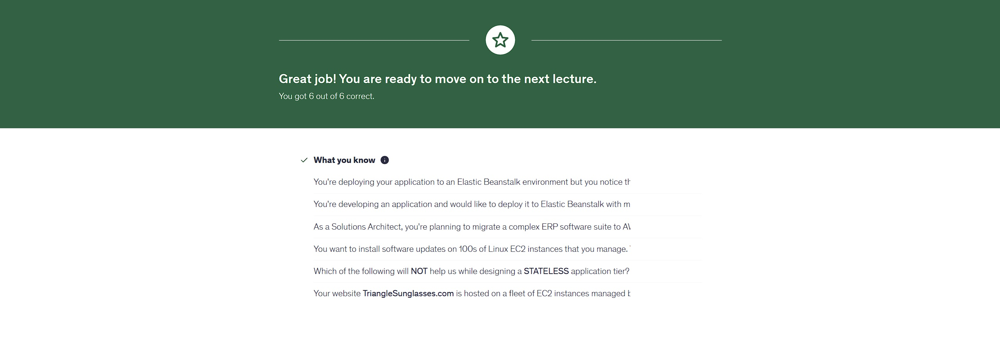
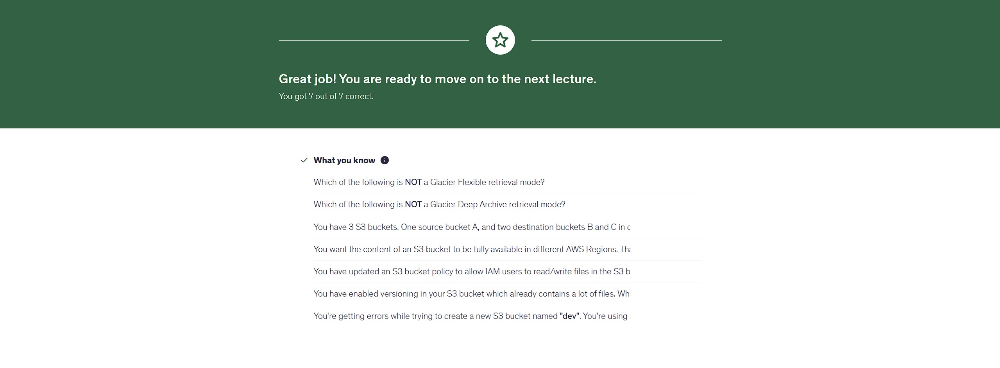
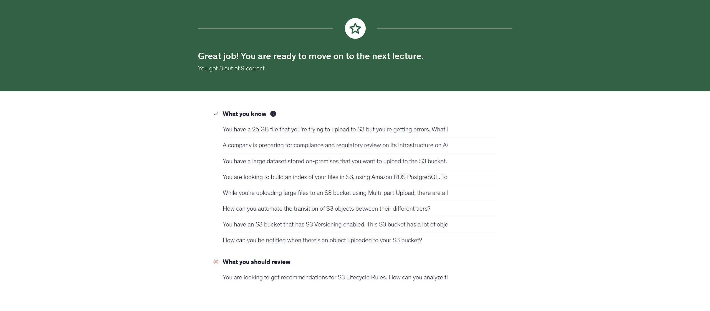
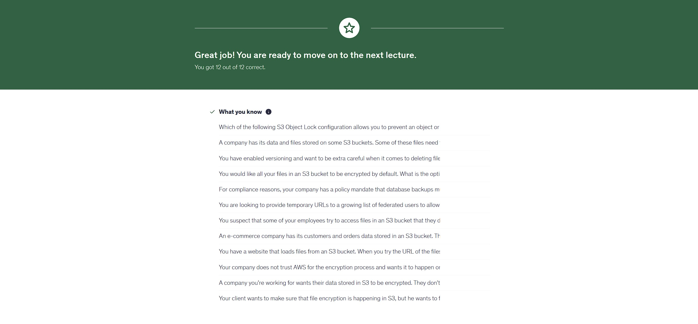

# 📘 Week 11 Homework Assignment – AWS SAA Prep


---

## 🎯 Objective  

Welcome to **Week 11 (Nov 18 – Nov 24, 2025)** of your AWS Solutions Architect Associate training!  
This week centers around **S3 (Simple Storage Service) mastery** and **architecture scenario discussions**, which are essential for both the exam and real-world AWS design.

This week includes:

- **Section 11 – Classic Solutions Architecture Discussions**  
- **Section 12 – Amazon S3 Introduction**  
- **Section 13 – Advanced Amazon S3**  
- **Section 14 – Amazon S3 Security**

S3 is one of the highest‑weighted services on the SAA, so Week 11 is **not optional** — it’s required for certification-level proficiency.

---

## 🗂 Project Structure  

```plaintext
week-11-homework/
.
├── .gitignore
├── section-11-quiz.jpg
├── section-12-quiz.jpg
├── section-13-quiz.jpg
└── section-14-quiz.jpg
```

---

## 📚 Weekly Study Breakdown  

---

## 🧩 **Section 11 – Classic Solutions Architecture Discussions**  

Prepare for scenario-based thinking:  

- Designing multi-tier architectures  
- Multi-AZ vs Multi-Region decisions  
- Load balancing + Auto Scaling integration  
- Stateless vs stateful architectures  
- Designing for fault tolerance and high availability  
- Caching strategies and content flows  

---

## 🪣 **Section 12 – Amazon S3 Introduction**  

Core fundamentals you MUST master:  

- S3 buckets, objects, and regions  
- Storage classes overview  
- Versioning  
- Lifecycle policies  
- S3 performance characteristics  
- Basic durability/availability concepts  

---

## 🚀 **Section 13 – Advanced Amazon S3**  

Deep-dive into advanced S3 architecture:  

- Multi-part uploads  
- S3 Select  
- S3 Transfer Acceleration  
- S3 replication: CRR vs SRR  
- Strong read-after-write consistency  
- Event notifications (SQS, SNS, Lambda)  

---

## 🔐 **Section 14 – Amazon S3 Security**  

Security is *always* on the exam. Study closely:  

- IAM policies vs bucket policies  
- Block Public Access — exam HOT TOPIC  
- Access Logs & object-level logging  
- KMS encryption (SSE-S3, SSE-KMS, CSE)  
- VPC Endpoints for S3  
- MFA Delete  
- Bucket ACLs (legacy but still testable)  

---

## 🖼 Maarek SAA Udemy: Quiz Screenshots  

- **Section 11 Quiz:**  
  

- **Section 12 Quiz:**  
  

- **Section 13 Quiz:**  
  
  
- **Section 14 Quiz:**  
  

---

## 🛠 Troubleshooting  

### ❓ I keep confusing S3 security layers  

Use this hierarchy:  

1. **IAM Policies = Identity permissions**  
2. **Bucket Policies = Resource-level permissions**  
3. **Block Public Access = Master override**  

### ⚠️ Replication not triggering?  

Check all required conditions:  

- Versioning enabled on both buckets  
- Correct IAM permissions  
- Correct replication rules  
- Not using SSE-C encryption (unsupported)  

### ❓ Architecture scenarios seem too open-ended  

Use the 5-key pillars:  

1. **Availability**  
2. **Scalability**  
3. **Security**  
4. **Cost**  
5. **Performance**  

Map each question to the pillar it targets.

---

## 🚀 Keep Grinding  

> [!NOTE]
> Week 11 is dense — but once you master S3 + architecture scenarios, the rest of the SAA exam becomes much easier.  
> Stay locked in. Stay dangerous. Stay **T.I.Q.S.**

---

## 💡 Tips for Mastery  

- Create your own S3 bucket and test versioning & lifecycle rules  
- Draw architecture flowcharts for Section 11 scenarios  
- Practice S3 replication hands-on  
- Compare all encryption options in a single cheat sheet  
- Rewatch tricky parts at 1.25× speed  

---

## ✍️ Authors & Acknowledgments

- **Author:** T.I.Q.S.
- **Group Leader:** John Sweeney

---
