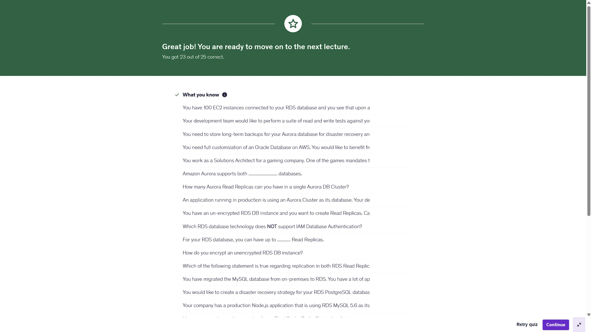
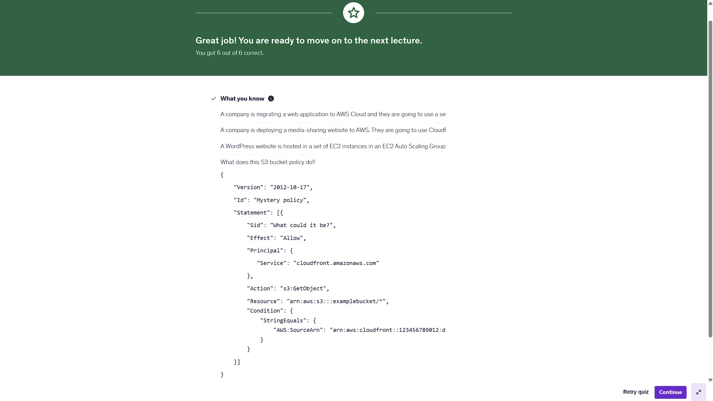
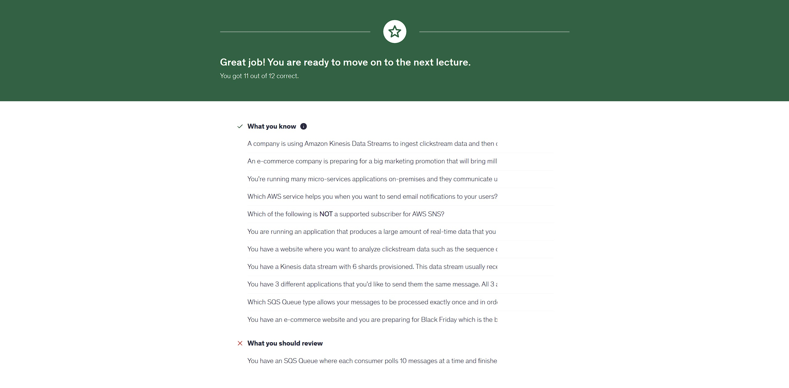

# 📘 Week 10 Homework Assignment – AWS SAA Prep


---

## 🎯 Objective  

Welcome to **Week 10 (Nov 11 – Nov 17, 2025)** of your AWS SAA learning journey.  
This updated homework focuses on **databases, content delivery, acceleration, and decoupling services** — all heavily tested subjects on the exam and critical for real-world architectures.

This week covers:

- **Section 9 – RDS, Aurora, and ElastiCache**
- **Section 15 – CloudFront & AWS Global Accelerator**
- **Section 17 – Decoupling Applications (SQS, SNS, Kinesis, ActiveMQ)**

---

## 🗂️ Project Structure  

```plaintext
week-10-homework/
.
├── .gitignore
├── section-9-quiz.jpg
├── section-15-quiz.jpg
└── section-17-quiz.jpg
```

---

## 📚 Weekly Study Breakdown  

---

## 🛢️ **Section 9 – RDS + Aurora + ElastiCache**

### **RDS**

- Multi-AZ synchronous replication  
- Read replicas (cross-AZ / cross-region)  
- Automated backups & snapshot restores  
- Parameter groups & option groups  
- Storage autoscaling  

### **Aurora**

- Cluster architecture: Writer + multiple Readers  
- Aurora Replicas vs RDS Replicas  
- Backtracking  
- Serverless v2 scaling  
- Global Database for sub-1s replication  

### **ElastiCache**

- Redis vs Memcached: When to choose each  
- Cluster modes, sharding, failover  
- Caching strategies (lazy loading, write-through)  
- Redis AUTH, encryption in transit, security groups  

---

## 🌐 **Section 15 – CloudFront & AWS Global Accelerator**

### **CloudFront**

- Edge locations & caching layers (Edge vs Regional Caches)  
- Origins: S3, ALB, EC2, API Gateway  
- Signed cookies, signed URLs  
- Origin Access Control (OAC) – *exam favorite*  
- Lambda@Edge & CloudFront Functions  

### **AWS Global Accelerator**

- Anycast IP addresses  
- Static entry point for multi-region backends  
- Health checks and regional failover  
- Accelerates TCP and UDP (CloudFront is HTTP/HTTPS)  
- Perfect for gaming, VoIP, low-latency apps  

---

## 🔄 **Section 17 – Decoupling with SQS, SNS, Kinesis, ActiveMQ**

### **SQS: (Simple Queue Service)**

- Standard vs FIFO  
- Visibility timeout, delay queues, DLQs  
- Long polling  
- Scaling patterns with ASG or Lambda consumers  

### **SNS: (Simple Notification Service)**

- Pub/Sub messaging  
- Fan-out patterns (SNS → SQS → Lambda)  
- Message filtering  

### **Kinesis: (Amazon Kinesis)**

- Data Streams (producers → shards → consumers)  
- Enhanced fan-out  
- Kinesis Firehose → S3 Redshift ES  
- Real-time analytics  

### **ActiveMQ (Amazon MQ)**

- Managed message broker  
- Supports JMS, MQTT, STOMP  
- Migrating legacy enterprise messaging  

---

## 🖼 Maarek's SAA Udemy Screenshots (Show Your Work)  

- **Section 9 Quiz:**  
  

- **Section 15 Quiz:**  
  

- **Section 17 Quiz:**  
  

---

## 🛠 Troubleshooting  

### ❓ I keep mixing up RDS Read Replicas vs Multi-AZ

- **Multi-AZ = Disaster recovery / standby**  
- **Read Replicas = Scaling reads**

### ❓ CloudFront vs Global Accelerator?

- **CloudFront → Caching content closer to users (Layer 7)**  
- **Global Accelerator → Accelerates TCP/UDP and improves failover (Layer 4)**  

### ❓ SQS vs SNS vs Kinesis?

Use this memory trick:  

- **SNS = Broadcast**  
- **SQS = Buffering**  
- **Kinesis = Streaming firehose of data**  

---

## 💡 Tips for Mastery  

- Draw out each service relationship on paper  
- Map quiz mistakes to the AWS documentation  
- Practice decoupling architecture questions  
- Review Global Accelerator diagrams carefully  

---

## 🚀 Crush Week 10  

> [!TIP]
> These sections combine core SAA exam concepts: **databases, global performance, and decoupling**.  
> Master them now — they will show up again in architectural scenarios and your upcoming labs.

---

## ✍️ Authors & Acknowledgments

- **Author:** T.I.Q.S.
- **Group Leader:** John Sweeney

---
